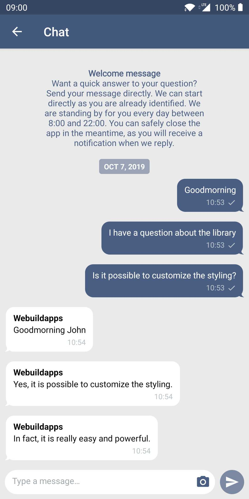

# Parley Messaging Android library

[](https://jitpack.io/#parley-messaging/android-library)

Easily setup a secure chat with the Parley Messaging Android library. The Parley SDK allows you to fully customize the chat style and integrate it seamlessly in your own app for a great user experience.

*Pay attention: You need an `appSecret` to use this library. The `appSecret` can be obtained by contacting [Parley](https://www.parley.nu/).*

## Requirements

- Android 4.1+ (API 16+)
- Android Studio 3.5+
- Using AndroidX artifacts
- Permissions (automatically added by the library)
  - android.permission.INTERNET - Required for chatting
  - android.permission.ACCESS_NETWORK_STATE - Required for detecting network changes
  - android.permission.WRITE_EXTERNAL_STORAGE **(API < 19)** - Required for supporting images in the chat. *Only applied in API 18 and lower.*

**Firebase**

For remote notifications Parley relies on Google Firebase. Configure Firebase (using the [installation guide](https://firebase.google.com/docs/android/setup)) if you haven't configured Firebase yet.

## Screenshots

Empty | Conversation
-- | --
 | 

## Installation

[JitPack](https://jitpack.io/) is a public maven repository and serves maven artifacts. For usage and installation instructions, visit their website.

To use JitPack, specify the following in your root `build.gradle` file:

```groovy
allprojects {
    repositories {
        // ...
        maven { url 'https://jitpack.io' }
    }
}
``` 

To integrate Parley, specify the following in your `app/build.gradle` file:

```groovy
implementation 'com.github.parley-messaging:android-library:3.2.0'
```

### Upgrading

Checkout [CHANGELOG.md](CHANGELOG.md) for the latest changes and upgrade notes.

## Getting started

Follow the next steps to get a minimal setup of the library.

### Step 1: Add the `ParleyView`

The `ParleyView` can be added to any view that exists in a *Fragment* or an *Activity*.

Add the `ParleyView` to the layout resource file.

```xml
<nu.parley.android.view.ParleyView
    android:id="@+id/parley_view"
    android:layout_width="match_parent"
    android:layout_height="match_parent" />
```


### Step 2: Configure Parley

Configure Parley with your `appSecret` with `Parley.configure(context, secret)` (for example in your *Activity* from step 1).

```java
Parley.configure(this, "appSecret");
```

*Replace `appSecret` by your Parley `appSecret`. The `appSecret` can be obtained by contacting [Parley](https://www.parley.nu/).*

### Step 3: Configure Firebase

Parley needs a push token to successfully handle remote notifications.

**Push Token**

After receiving a push token via your Firebase instance, pass it to the Parley instance in order to support remote notifications. This is can be done by using `Parley.setPushToken(pushToken);`.

```java
Parley.setPushToken("pushToken");
```

**Other push types**

```java
Parley.setPushToken("pushToken", PushType.CUSTOM_WEBHOOK);
Parley.setPushToken("pushToken", PushType.CUSTOM_WEBHOOK_BEHIND_OAUTH);
Parley.setPushToken("pushToken", PushType.FCM); // Default
```

**Handle remote notifications**

Open your `FirebaseMessagingService` and add `Parley.handle(context, remoteMessage, intent)` to the `onMessageReceived` method to handle remote notifications.

```java
public final class FirebaseMessagingService extends com.google.firebase.messaging.FirebaseMessagingService {

    @Override
    public void onMessageReceived(@NonNull RemoteMessage remoteMessage) {
        super.onMessageReceived(remoteMessage);

        Intent intent = new Intent(this, ChatActivity.class);
        intent.setFlags(Intent.FLAG_ACTIVITY_NEW_TASK | Intent.FLAG_ACTIVITY_CLEAR_TASK);

        boolean handledByParley = Parley.handle(this, remoteMessage.getData(), intent);
    }
}
```

### Step 4: Forward *Activity* results

Open the *Activity* in which the `ParleyView` is visible and add `Parley.onActivityResult(requestCode, resultCode, data)` to the `onActivityResult` method of the *Activity*.

```java
@Override
protected void onActivityResult(int requestCode, int resultCode, @Nullable Intent data) {
    super.onActivityResult(requestCode, resultCode, data);

    boolean handledByParley = Parley.onActivityResult(requestCode, resultCode, data);
}
```

### Step 5: Network Security Configuration

By default Parley enforces the use of SSL pinning. Open the `AndroidManifest.xml` and add the Network Security Configuration of Parley to the `Application` tag.

```xml
<application
    android:networkSecurityConfig="@xml/parley_network_security_config">
```

*More information about the Network Security Configuration can be found on [Android Developers](https://developer.android.com/training/articles/security-config).*


## Advanced

Parley allows the usage of advanced configurations, such as specifying the network, specifying the user information or enabling offline messaging. In all use cases it is recommended to apply the advanced configurations before configuring the chat with `Parley.configure(secret)`.

### Network

The network configuration can be set by setting a `ParleyNetwork` with the `Parley.setNetwork(_ network: ParleyNetwork)` method.

```java
ParleyNetwork network = new ParleyNetwork(
        "https://api.parley.nu/",
        "clientApi/v1.2/",
        R.xml.parley_network_security_config // Must be the same resource as defined in `AndroidManifest.xml`
);

Parley.setNetwork(network);
```

*Note that when using a custom Network Security Configuration, it is also required to use the same reference in inside the `AndroidManifest.xml`.*

**Custom headers**

Custom headers can be set by using the optional parameter `headers` in `ParleyNetwork`. The parameter accepts a `Map<String, String>`.

Note that the headers used by Parley itself cannot be overridden.

```java
Map<String, String> headers = new HashMap<>();
headers.put("X-Custom-Header", "Custom header value");

ParleyNetwork network = new ParleyNetwork(
        "https://api.parley.nu/",
        "clientApi/v1.2/",
        R.xml.parley_network_security_config,
        headers
);

Parley.setNetwork(network);
```

**Custom SSL pinning**

With the default configuration Parley enforces SSL pinning. Customizing this can be done by creating a new `network_security_config.xml` file.

In the `AndroidManifest.xml` set the `networkSecurityConfig` property to the created `network_security_config.xml`.

Next, pass the new `network_security_config` to the ParleyNetwork object when calling `Parley.setNetwork(network)`.

**Enforcing SSL pinning**

Parley uses TrustKit to support SSL pinning on lower API levels. To enforce SSL pinning, make sure that the `network_security_config.xml` has the following in the `<domain-config>` block as well:

```xml
<trustkit-config enforcePinning="true"/>
```

*Note that setting this `true` will enforce SSL pinning and causes all requests to fail if SSL pinning fails. Whereas setting this `false` will still execute SSL pinning, but requests will proceed if SSL pinning fails.*

### User information

The chat can be identified and encrypted by applying an authorization token to the `Parley.setUserInformation(authorization)` method. The token can easily be generated on a secure location by following the _[Authorization header](https://developers.parley.nu/docs/authorization-header)_ documentation.

```java
String authorization = "ZGFhbnw5ZTA5ZjQ2NWMyMGNjYThiYjMxNzZiYjBhOTZmZDNhNWY0YzVlZjYzMGVhNGZmMWUwMjFjZmE0NTEyYjlmMDQwYTJkMTJmNTQwYTE1YmUwYWU2YTZjNTc4NjNjN2IxMmRjODNhNmU1ODNhODhkMmQwNzY2MGYxZTEzZDVhNDk1Mnw1ZDcwZjM5ZTFlZWE5MTM2YmM3MmIwMzk4ZDcyZjEwNDJkNzUwOTBmZmJjNDM3OTg5ZWU1MzE5MzdlZDlkYmFmNTU1YTcyNTUyZWEyNjllYmI5Yzg5ZDgyZGQ3MDYwYTRjZGYxMzE3NWJkNTUwOGRhZDRmMDA1MTEzNjlkYjkxNQ";
Parley.setUserInformation(authorization);
```

**Additional information**

Additionally, you can set additional information of the user by using the `additionalInformation` parameter in `Parley.setUserInformation()` method. The parameter accepts a `Map<String, String>`.

```java
Map<String, String> additionalInformation = new HashMap<>();
additionalInformation.put(Parley.ADDITIONAL_VALUE_NAME, "John Doe");
additionalInformation.put(Parley.ADDITIONAL_VALUE_EMAIL, "j.doe@parley.nu");
additionalInformation.put(Parley.ADDITIONAL_VALUE_ADDRESS, "Randstad 21 30, 1314, Nederland");

String authorization = "ZGFhbnw5ZTA5ZjQ2NWMyMGNjYThiYjMxNzZiYjBhOTZmZDNhNWY0YzVlZjYzMGVhNGZmMWUwMjFjZmE0NTEyYjlmMDQwYTJkMTJmNTQwYTE1YmUwYWU2YTZjNTc4NjNjN2IxMmRjODNhNmU1ODNhODhkMmQwNzY2MGYxZTEzZDVhNDk1Mnw1ZDcwZjM5ZTFlZWE5MTM2YmM3MmIwMzk4ZDcyZjEwNDJkNzUwOTBmZmJjNDM3OTg5ZWU1MzE5MzdlZDlkYmFmNTU1YTcyNTUyZWEyNjllYmI5Yzg5ZDgyZGQ3MDYwYTRjZGYxMzE3NWJkNTUwOGRhZDRmMDA1MTEzNjlkYjkxNQ";
Parley.setUserInformation(authorization, additionalInformation);
```

**Clear user information**

```java
Parley.clearUserInformation();
```

### Offline messaging

Offline messaging can be enabled with the `Parley.enableOfflineMessaging(dataSource)` method. `ParleyDataSource` is an interface that can be used to create your own (secure) data source. In addition to this, Parley provides an encrypted data source called `ParleyEncryptedDataSource` which uses AES encryption.

```java
Parley.enableOfflineMessaging(new ParleyEncryptedDataSource(this, "1234567890123456"));
```

**Disable offline messaging**

```java
Parley.disableOfflineMessaging();
```

### Send a (silent) message

In some cases it may be handy to send a message for the user. You can easily do this by calling;

```java
Parley.send("Lorem ipsum dolar sit amet");
```

**Silent**

It is also possible to send silent messages. Those messages are not visible in the chat.

```java
Parley.send("User opened chat", true);
```

### Referrer

```java
Parley.setReferrer("https://parley.nu/");
```

## Customize

### Callbacks

Parley provides a `ParleyView.Listener` that can be set on the `ParleyView` for receiving callbacks.

```java
parleyView.setListener(new ParleyView.Listener() {
    @Override
    public void onMessageSent() {
        Log.d("Parley", "The user did sent a message");
    }
});
```

### Styling

**Images**

Image upload is enabled by default. The `ParleyView.setImagesEnabled(enabled)` method can be used to disable this.

```java
parleyView.setImagesEnabled(false);
```

**Styling**

Parley comes with a default style by using the Android resource files. Customizing the style can be done by overriding the values of Parley. Check out [parley_configuration.xml](parley/src/main/res/values/parley_configuration.xml) for the available options.

## License

Parley is available under the MIT license. See the [LICENSE](LICENSE) file for more info.